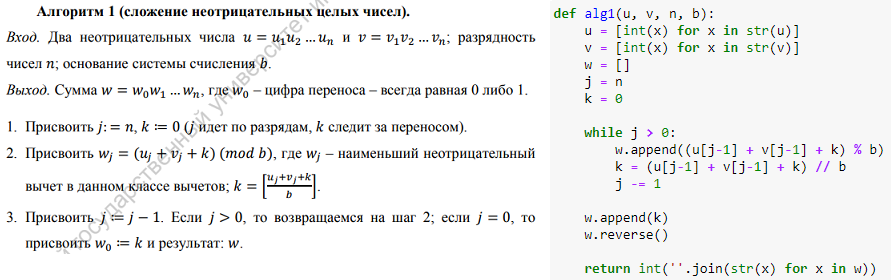

---
## Front matter
lang: ru-RU
title: |
    Отчёт по лабораторной работе №8.  
    Целочисленная арифметика многократной точности
author: |
    *Дисциплина: Математические основы защиты информации*  
    *и информационной безопасности*  
    \vspace{2pt}  
    **Студент:** Майорова О.А., 1032212322  
		**Группа:** НФИмд-02-21  
		**Преподаватель:** д.ф.-м.н., Кулябов Д. С. 
    \vspace{2pt}
date: Москва, 2021

## Formatting
toc: false
slide_level: 2
theme: metropolis
header-includes:
 - \metroset{progressbar=frametitle,sectionpage=progressbar,numbering=fraction}
 - '\makeatletter'
 - '\beamer@ignorenonframefalse'
 - '\makeatother'
aspectratio: 43
section-titles: true
linestretch: 1.25

mainfont: PT Serif
romanfont: PT Serif
sansfont: PT Sans
monofont: PT Mono
mainfontoptions: Ligatures=TeX
romanfontoptions: Ligatures=TeX
sansfontoptions: Ligatures=TeX,Scale=MatchLowercase
monofontoptions: Scale=MatchLowercase,Scale=0.7
---

## Цель и задачи

_Цель_: Ознакомиться с целочисленной арифметикой многократной точности.

_Задача_: Программно реализовать алгоритмы: сложения неотрицательных целых чисел, вычитания неотрицательных целых чисел, 
умножения неотрицательных целых чисел, быстрый столбик и деления многоразрядных целых чисел.

## Сложение неотрицательных целых чисел
{ #fig:alg1 width=100% }
Результат:
{ #fig:alg1res width=100% }

## Вычитание неотрицательных целых чисел
{ #fig:alg2 width=100% }
Результат:
{ #fig:alg2res width=100% }

## Умножение неотрицательных целых чисел
{ #fig:alg3 width=100% }
Результат:
{ #fig:alg3res width=100% }

## Быстрый столбик
{ #fig:alg4 width=100% }
Результат:
{ #fig:alg4res width=100% }

## Деление многоразрядных целых чисел
{ #fig:alg5 width=100% }
Результат:
{ #fig:alg5res width=100% }

## Заключение
Таким образом, была достигнута цель, поставленная в начале лабораторной работы.

- Было осуществлено знакомство с целочисленной арифметикой многократной точности.

- Также была получена реализация на языке Python алгоритмов сложения неотрицательных целых чисел, вычитания неотрицательных целых чисел, 
умножения неотрицательных целых чисел, быстрый столбик и деления многоразрядных целых чисел.

# Спасибо за внимание
